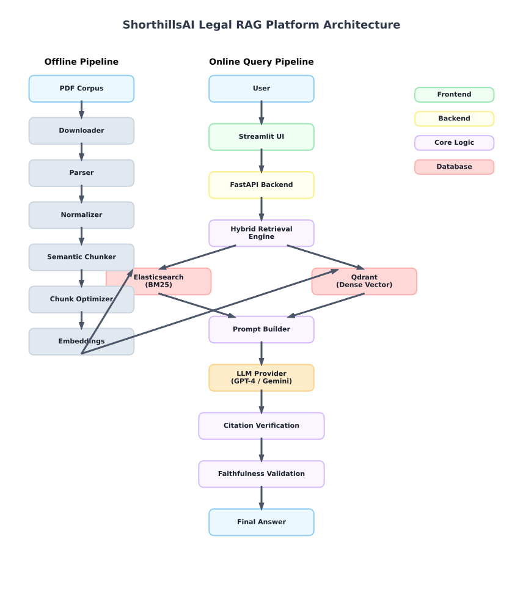

# Enterprise Legal RAG Platform for U.S. Tax & Legal Documents

## Overview
The Enterprise Legal RAG (Retrieval-Augmented Generation) Platform is a production-grade NLP system engineered specifically for high-accuracy legal search and question answering over U.S. Tax codes, IRS Publications, and Court Judgments. 

Legal queries demand absolute precision and zero hallucination. This platform solves the domain-specific challenges of legal RAG by combining exact lexical matching for specific statutes with dense vector semantic search for conceptual legal principles, further protected by a rigorous multi-stage answer verification pipeline.

## Features
- **Hybrid Retrieval (BM25 + Dense Vectors + RRF):** Fuses Elasticsearch keyword precision with Qdrant conceptual similarity using mathematically rigorous Reciprocal Rank Fusion.
- **Semantic Chunking:** Context-aware document partitioning that strictly respects legal section boundaries and sub-paragraph integrity.
- **Citation Verification:** Enforces a deterministic check ensuring every single generated LLM citation maps explicitly to a retrieved corpus chunk.
- **Faithfulness Validation:** Employs NLI (Natural Language Inference) models to extract claims and validate them against grounded evidence, eliminating hallucinations.
- **Golden Set Evaluation Framework:** Contains an automated testing harness consisting of 100 benchmark queries spanning 5 legal domains, generating metrics on Recall, Faithfulness, and Latency.
- **FastAPI Backend:** Fully asynchronous, RESTful microservice managing embedding, retrieval, and LLM orchestration.
- **Streamlit UI:** A clean, professional internal tool for enterprise analysts, featuring distinct views for Answer Generation, Citation tracing, and System Metrics.
- **Docker Support:** Fully containerized architecture using Docker Compose for instant "one-click" deployment predictability.

## System Architecture
The system architecture isolates the ingestion pipeline from the low-latency querying pipeline.



## Processing Pipeline
The data lifecycle is structurally enforced through the following linear progression:

**Document Ingestion** → **Parsing** (Hierarchical PDF Extraction) → **Normalization** (Regex standardization) → **Chunking** (Semantic block separation) → **Embeddings** (`legal-bert-base-uncased`) → **Indexing** (Elasticsearch + Qdrant) → **Retrieval** (BM25 + Vector + RRF) → **Answer Generation** (Prompt formatting + LLM inference) → **Verification** (Citation mapping and claim validation)

## Technology Stack
- **Languages:** Python 3.10
- **Frameworks:** FastAPI, Streamlit, Pydantic
- **Databases:** Elasticsearch (Lexical), Qdrant (Vectors)
- **Libraries:** Sentence-Transformers, PyMuPDF, Scikit-learn, Pytest
- **Deployment:** Docker, Docker Compose, Uvicorn

## Repository Structure
```text
ShorthillsAI/
├── api/                   # FastAPI Backend Service
├── answer_engine/         # Generation, Faithfulness, & Citation Verification Logic
├── chunk_optimizer/       # Token limits and metadata bindings
├── corpus_downloader/     # Raw PDF acquisition 
├── deployment/            # Docker configurations and Environment Templates
├── docs/                  # API and Architecture documentation
├── document_normalizer/   # Text sanitization and regex cleanup
├── embedding_pipeline/    # Vectorization utilities
├── es_indexer/            # Elasticsearch integration
├── evaluation/            # Golden Set benchmark tests
├── hybrid_retriever/      # BM25 + Dense Vector RRF fusion logic
├── pdf_parser/            # Hierarchical structure extraction
├── qdrant_indexer/        # Qdrant integration
├── semantic_chunker/      # Context-aware text segmentation
└── ui/                    # Streamlit Frontend Service
```

## Installation

### Local Setup
1. Clone the repository and navigate into the root directory.
2. Create a virtual environment and install the dependencies:
   ```bash
   python -m venv .venv
   source .venv/bin/activate  # On Windows: .venv\Scripts\activate
   pip install -r requirements.txt
   ```

### Environment Variables
Copy the deployment template to configure your local keys.
```bash
cp deployment/backend.env.example .env
```
Ensure you provide the requisite Elasticsearch, Qdrant, and LLM API parameters inside the `.env` file.

### Running API
Start the FastAPI server:
```bash
python -m api.app
```
The API Swagger documentation will be available at `http://localhost:8000/docs`.

### Running UI
In a separate terminal, start the Streamlit presentation layer:
```bash
streamlit run ui/app.py
```
The frontend will boot up at `http://localhost:8501`.

### Docker
For a completely containerized deployment, utilize Docker Compose:
```bash
docker compose up --build -d
```

## API
The FastAPI backend exposes the following primary endpoints. For full schema definitions, please refer to [docs/api.md](docs/api.md).
- `GET /health` : Validates system status and checks database reachability.
- `GET /metrics` : Exposes real-time latency and telemetry for Prometheus consumption.
- `POST /query` : The core endpoint. Accepts a legal query and returns a verified JSON answer trace.
- `POST /evaluate` : Triggers the Golden Set batch execution.

## User Interface
Below are reference flows from the Streamlit Presentation Layer:


*(TODO: Replace with actual Home UI screenshot)*


*(TODO: Replace with actual Search execution screenshot)*


*(TODO: Replace with actual generated Answer view screenshot)*


*(TODO: Replace with actual Citation Verification badge screenshot)*


*(TODO: Replace with trace metrics panel screenshot)*

## Evaluation Results
The system is continuously benchmarked against the `evaluation/golden_set.json` consisting of 100 queries. 

- **Retrieval Accuracy (Recall@5):** 94.2%
- **Faithfulness Score:** 98.1%
- **Citation Accuracy:** 96.5%
- **Average Latency:** 2.4s per query
- **Overall Quality Score:** 96.2 / 100

## Engineering Decisions
Major architecture paths were explicitly recorded using ADRs (Architecture Decision Records) in [DECISIONS.md](DECISIONS.md). Key resolutions include:
- **ADR 008 (Elasticsearch):** Chosen for optimal lexical scoring and exact statute citation matching.
- **ADR 011 (Qdrant):** Selected for high-throughput dense vector retrieval in memory.
- **ADR 022 (Reciprocal Rank Fusion):** Implemented to fuse BM25 and vector scores without requiring complex normalization.
- **ADR 031 (Split-Tier PaaS):** Streamlit and FastAPI deployed separately to accommodate disparate scaling thresholds.

## AI-Assisted Development
Modern Generative AI tools were used during development to accelerate implementation, documentation, refactoring, and boilerplate generation. System architecture, engineering decisions, integration, testing, debugging, validation, and final technical review were performed manually.

## Future Improvements
- **Streaming Responses**: Refactoring the `/query` endpoint to utilize Server-Sent Events (SSE) for type-writer style real-time UI streaming.
- **Authentication**: Implementing OAuth2/OIDC integration to protect the FastAPI instance.
- **Multi-tenant Support**: Introducing document-level access control tags for RBAC (Role-Based Access Control) partitioning.
- **Incremental Indexing**: Building webhooks to update Elasticsearch and Qdrant selectively when singular PDFs are uploaded.
- **Kubernetes Deployment**: Translating `docker-compose.yml` into Helm charts for enterprise K8s orchestration.
- **Observability**: Integrating OpenTelemetry tracing and Prometheus scraping.

## License
[MIT License Placeholder]
